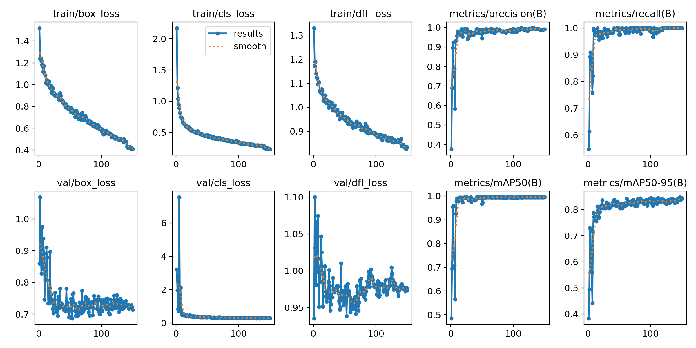
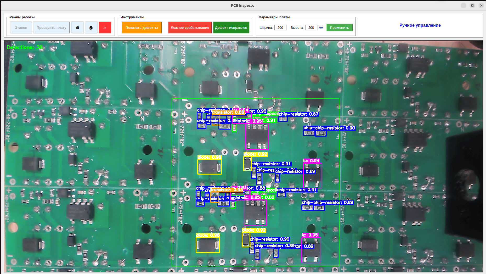

# YOLOv8 PCB Detection

Real-time detection and classification of electronic components on printed circuit boards using YOLOv8, optimized for ARM64 edge devices (Raspberry Pi, Orange Pi) with RKNN acceleration.

## Tech Stack

- **Framework:** [Ultralytics YOLOv8](https://github.com/ultralytics/ultralytics)
- **Language:** Python 3.10
- **Deep Learning:** PyTorch
- **Edge Acceleration:** RKNN Toolkit 2 (for NPU inference on Rockchip SoCs)
- **Containerization:** Docker & Docker Compose

## Results & Demo

### Training Metrics


### Real-Time Detection


## Quick Start

Prerequisites: [Docker](https://docs.docker.com/get-docker/) and [Docker Compose](https://docs.docker.com/compose/install/).

1. Clone the repository:
   ```bash
   git clone https://github.com/olegofriendz/yolov8-pcb-detection.git
   cd yolov8-pcb-detection
   ```

2. Run the application:
   ```bash
   ./run.sh
   # Or manually:
   # docker compose up --build
   ```
The container will start, mount your local code for hot-reloading, and launch the detection interface.

## Manual Setup

> **Note:** Python 3.10 is required for Orange Pi to ensure compatibility with the pre-built ARM64 dependencies.

1. Clone the repository:
   ```bash
   git clone https://github.com/olegofriendz/yolov8-pcb-detection.git
   cd yolov8-pcb-detection
   ```

2. **Create and activate a virtual environment:**
   ```bash
   python3.10 -m venv .venv
   source .venv/bin/activate
   ```

3. **Install architecture-specific dependencies (RKNN Toolkit):**
   ```bash
   pip install requirements/arm64/rknn_toolkit2-2.3.2-cp310-cp310-manylinux_2_17_aarch64.manylinux2014_aarch64.whl
   ```

4. **Install the project in editable mode:**
   ```bash
   pip install -e .
   ```

5. **Start:**
   ```bash
   python app/main.py
   ```

## Model Conversion Pipeline

To deploy models on NPU, follow this conversion chain:

1. **Download Dataset**: Use `pcb-download` or `python src/data/download.py` to download dataset from Roboflow.
2. **Tile Dataset**: Use `pcb-tile` or `python src/data/tile.py` to convert the dataset to the desired resolution (default: 640px, 20% overlap):
   
   ```bash
   pcb-tile --size 640 --overlap 0.2
   ```
4. **Train**: Use `pcb-train` or `python src/training/train.py`.
5. **Export to ONNX**:
   
   ```bash
   python app/utils/converters/pt_to_onnx.py --pt runs/detect/train/weights/best.pt
   ```
7. **Convert to RKNN**:
   
   ```bash
   python app/utils/converters/onnx_to_rknn.py --onnx runs/detect/train/weights/best.onnx
   ```

## Configuration

Environment variables can be adjusted in `docker-compose.yml`:
- `DISPLAY`: For X11 forwarding (GUI support).
- Device mappings (`/dev/video0`, `/dev/dri`) ensure access to camera and NPU/GPU.
